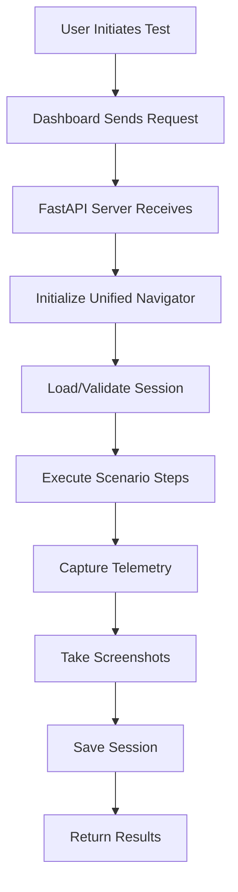
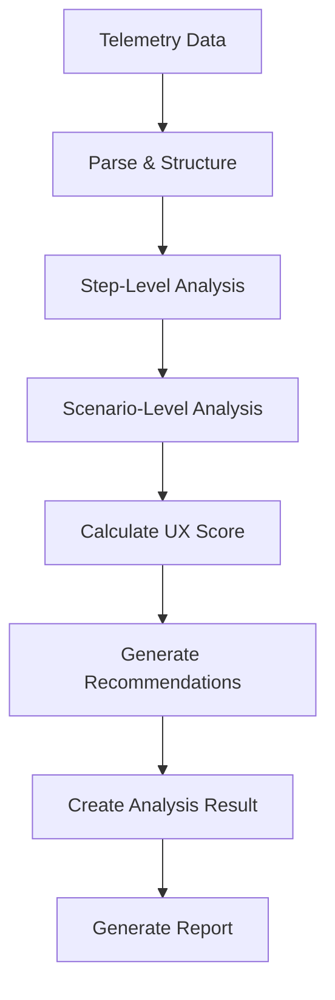
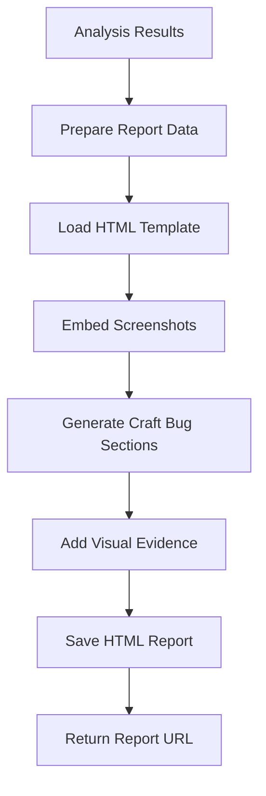

# 🚀 CraftBug Agentic System - Technical Documentation & Developer Handoff

## 📋 **System Overview**

The **CraftBug Agentic System** is an advanced UX analysis and bug detection platform that automatically identifies user experience issues in web applications through intelligent browser automation, telemetry collection, and AI-powered analysis. The system specifically targets Microsoft Excel Web but is architected for extensibility to other applications.

## 🎯 **Core Purpose**

The system simulates a **Synthetic UX Designer** that:
1. **Executes realistic user workflows** in web applications
2. **Captures comprehensive telemetry** (screenshots, timing, UI states)
3. **Analyzes user experience** using AI and design principles
4. **Generates detailed reports** with visual evidence and actionable recommendations
5. **Detects "Craft Bugs"** - UX issues that impact user satisfaction and workflow efficiency

## 🏗️ **System Architecture**

### **High-Level Architecture**

```
┌─────────────────┐    ┌─────────────────┐    ┌─────────────────┐
│   Web Dashboard │    │  FastAPI Server │    │  Browser Engine │
│   (React/TS)    │◄──►│   (Python)      │◄──►│  (Selenium/     │
│                 │    │                 │    │   Playwright)   │
└─────────────────┘    └─────────────────┘    └─────────────────┘
         │                       │                       │
         │                       │                       │
         ▼                       ▼                       ▼
┌─────────────────┐    ┌─────────────────┐    ┌─────────────────┐
│   Report Viewer │    │  Analysis Engine│    │  Telemetry      │
│   (HTML/CSS)    │    │   (AI/ML)       │    │  Collection     │
└─────────────────┘    └─────────────────┘    └─────────────────┘
```

### **Component Architecture**

```
📁 CraftBug_Agentic_System/
├── 🎯 Core Components
│   ├── src/excel/
│   │   ├── core/           # Configuration, Navigation, Session Management
│   │   ├── analysis/       # UX Analysis Engine
│   │   ├── scenarios/      # Test Scenario Definitions
│   │   └── reporting/      # Report Generation
│   └── src/shared/         # Shared Utilities
├── 🌐 Web Interface
│   ├── web-ui/             # React Dashboard
│   └── enhanced_fastapi_server.py  # Main API Server
├── 🧪 Testing & Validation
│   ├── tests/              # Comprehensive Test Suite
│   └── test_*.py           # End-to-End Tests
└── 📊 Data & Reports
    ├── reports/            # Generated HTML Reports
    ├── screenshots/        # Captured Visual Evidence
    └── telemetry_output/   # Raw Telemetry Data
```

## 🔧 **Core Components Deep Dive**

### **1. Configuration Management (`src/excel/core/config.py`)**

**Purpose**: Centralized, type-safe configuration management

```python
@dataclass
class ExcelWebConfig:
    """Excel Web specific configuration"""
    base_url: str = "https://www.office.com/launch/excel"
    timeout: int = 30
    screenshot_dir: str = "screenshots/excel_web"
    session_storage_path: str = "sessions/excel_web"
    session_timeout: int = 3600  # 1 hour

class ExcelAnalysisConfig:
    """Main configuration class that consolidates all settings"""
    def __init__(self):
        self.excel_web = ExcelWebConfig()
        self.auth = AuthenticationConfig()
        self.analysis = AnalysisConfig()
        self.reporting = ReportingConfig()
        # ... other configs
```

**Key Features**:
- **Type-safe configuration** using dataclasses
- **Environment variable integration** with automatic loading
- **Validation and defaults** for all settings
- **Backward compatibility** functions

### **2. Unified Navigator (`src/excel/core/navigator.py`)**

**Purpose**: Browser automation and session management

```python
class UnifiedExcelNavigator:
    """Unified browser automation for Excel Web"""
    
    def __init__(self, config: Optional[ExcelWebConfig] = None):
        self.config = config or get_config().get_excel_web_config()
        self.session_manager = SessionManager()
        self.selenium_driver: Optional[webdriver.Chrome] = None
        self.playwright_browser: Optional[Browser] = None
        # ... initialization
    
    async def ensure_authenticated(self, method: str = "auto") -> AuthenticationResult:
        """Handle authentication with multiple methods"""
        
    async def take_screenshot(self, reason: str = "debug") -> Optional[str]:
        """Capture screenshots with automatic naming"""
```

**Key Features**:
- **Multi-engine support** (Selenium + Playwright)
- **Session persistence** and restoration
- **Automatic screenshot capture**
- **Error handling** with detailed context
- **Authentication management** (manual, auto, session-based)

### **3. Analysis Engine (`src/excel/analysis/analyzer.py`)**

**Purpose**: UX analysis and Craft Bug detection

```python
class UnifiedExcelAnalyzer:
    """Unified Excel Analysis Engine"""
    
    async def analyze_telemetry_data(self, telemetry_data: Dict[str, Any]) -> UXAnalysisResult:
        """Analyze telemetry data and generate UX insights"""
        
    async def _analyze_steps(self):
        """Analyze individual steps for UX issues"""
        
    async def _analyze_scenario_level_issues(self):
        """Analyze scenario-level UX issues"""
        
    def _calculate_ux_score(self) -> float:
        """Calculate overall UX score based on analysis results"""
```

**Key Features**:
- **Step-level analysis** for granular UX issues
- **Scenario-level analysis** for overall workflow problems
- **Craft Bug categorization** (Performance, Reliability, Usability, UX)
- **UX score calculation** with severity-based penalties
- **Recommendation generation** based on detected issues

### **4. Session Management (`src/excel/core/session.py`)**

**Purpose**: Browser session persistence and management

```python
@dataclass
class ExcelWebSession:
    """Excel Web session data"""
    session_id: str = ""
    created_at: datetime = None
    last_used: datetime = None
    is_valid: bool = True
    cookies: Dict[str, Any] = None
    local_storage: Dict[str, str] = None
    session_data: Dict[str, str] = None

class SessionManager:
    """Unified session manager"""
    
    async def create_session(self) -> ExcelWebSession:
        """Create a new session"""
        
    async def save_session(self, session: ExcelWebSession) -> bool:
        """Save session to persistent storage"""
        
    async def load_session(self, session_id: str) -> Optional[ExcelWebSession]:
        """Load session from persistent storage"""
```

**Key Features**:
- **Session persistence** across browser restarts
- **Automatic cleanup** of expired sessions
- **Cookie and storage management**
- **Session validation** and integrity checks

## 🔄 **System Workflow**

### **1. Scenario Execution Flow**



### **2. Analysis Flow**



### **3. Report Generation Flow**



## 🎨 **Craft Bug Detection System**

### **Bug Categories**

1. **Performance Issues**
   - Slow step execution (>10 seconds)
   - Overall slow performance (>60 seconds)
   - Memory usage problems

2. **Reliability Issues**
   - Step execution failures
   - Scenario completion failures
   - Error state detection

3. **Usability Issues**
   - Excessive step complexity (>15 steps)
   - Poor workflow design
   - Cognitive load problems

4. **User Experience Issues**
   - Multiple dialog interruptions (>2 dialogs)
   - Poor feedback mechanisms
   - Inconsistent UI states

### **UX Score Calculation**

```python
def _calculate_ux_score(self) -> float:
    base_score = 100.0
    
    # Deduct points for each craft bug
    severity_penalties = {
        "low": 5.0,
        "medium": 15.0,
        "high": 30.0,
        "critical": 50.0
    }
    
    for bug in self.craft_bugs_detected:
        penalty = severity_penalties.get(bug.severity, 10.0)
        base_score -= penalty
    
    # Additional penalties for performance issues
    if self.telemetry_data.total_duration_ms > 60000:
        base_score -= 20.0
    
    return max(0.0, min(100.0, base_score))
```

## 🌐 **API Endpoints**

### **Main Endpoints**

```python
# Scenario Execution
POST /api/excel-web/execute-scenario
{
    "scenario_name": "document_creation",
    "parameters": {}
}

# UX Report Generation
POST /api/excel-web/ux-report
{
    "scenario_name": "document_creation",
    "include_screenshots": true
}

# Report Retrieval
GET /reports/excel_ux/{report_filename}
```

### **Response Structure**

```python
{
    "success": True,
    "report_url": "/reports/excel_ux/excel_ux_report_20250820_130427.html",
    "report_filename": "excel_ux_report_20250820_130427.html",
    "screenshots_included": True,
    "craft_bugs_with_visual_evidence": 5,
    "total_screenshots": 4,
    "execution_time_seconds": 58.98
}
```

## 📊 **Data Structures**

### **Telemetry Data Structure**

```python
@dataclass
class TelemetryData:
    scenario_name: str
    start_time: datetime
    end_time: datetime
    total_duration_ms: float
    steps: List[Dict[str, Any]]
    overall_success: bool
    screenshots: List[str] = field(default_factory=list)
    errors: List[str] = field(default_factory=list)
```

### **Craft Bug Structure**

```python
@dataclass
class CraftBug:
    title: str
    description: str
    severity: str  # "low", "medium", "high", "critical"
    category: str
    step_name: Optional[str] = None
    screenshot_path: Optional[str] = None
    recommendations: List[str] = field(default_factory=list)
    metadata: Dict[str, Any] = field(default_factory=dict)
```

### **Analysis Result Structure**

```python
@dataclass
class UXAnalysisResult:
    success: bool
    ux_score: float = 0.0
    craft_bugs: List[Dict[str, Any]] = field(default_factory=list)
    recommendations: List[str] = field(default_factory=list)
    analysis_data: Dict[str, Any] = field(default_factory=dict)
    error: Optional[str] = None
```

## 🧪 **Testing Architecture**

### **Test Categories**

1. **Unit Tests** (`tests/excel/test_*.py`)
   - Individual component testing
   - Mock-based isolation
   - Edge case coverage

2. **Integration Tests** (`tests/integration/test_*.py`)
   - Component interaction testing
   - Real environment validation
   - Configuration integration

3. **End-to-End Tests** (`test_enhanced_excel_report.py`)
   - Full workflow validation
   - Report generation verification
   - Screenshot integration testing

### **Test Coverage**

```bash
# Run all tests
python -m pytest tests/ -v

# Run specific test categories
python -m pytest tests/excel/ -v
python -m pytest tests/integration/ -v

# Run end-to-end test
python test_enhanced_excel_report.py
```

## 🔧 **Development Setup**

### **Environment Requirements**

```bash
# Python 3.11+
# Node.js 18+ (for web dashboard)
# Chrome/Chromium browser
# Git

# Install Python dependencies
pip install -r requirements.txt

# Install Node.js dependencies
cd web-ui
npm install
```

### **Configuration Setup**

```bash
# Create .env file
cp .env.example .env

# Set required environment variables
OPENAI_API_KEY=your_openai_key
MICROSOFT_EMAIL=your_microsoft_email
MICROSOFT_PASSWORD=your_microsoft_password
```

### **Running the System**

```bash
# Start the FastAPI server
python enhanced_fastapi_server.py

# Start the web dashboard (in another terminal)
cd web-ui
npm start

# Run end-to-end test
python test_enhanced_excel_report.py
```

## 🚀 **Deployment Architecture**

### **Production Setup**

```yaml
# docker-compose.yml
version: '3.8'
services:
  api-server:
    build: .
    ports:
      - "8000:8000"
    environment:
      - OPENAI_API_KEY=${OPENAI_API_KEY}
    volumes:
      - ./reports:/app/reports
      - ./screenshots:/app/screenshots
      
  web-dashboard:
    build: ./web-ui
    ports:
      - "3000:3000"
    depends_on:
      - api-server
```

### **Monitoring & Logging**

```python
# Logging configuration
import logging

logging.basicConfig(
    level=logging.INFO,
    format='%(asctime)s - %(name)s - %(levelname)s - %(message)s',
    handlers=[
        logging.FileHandler('craftbug.log'),
        logging.StreamHandler()
    ]
)
```

## 🔄 **Refactoring Status**

### **Completed Phases**

✅ **Phase 1: Core Infrastructure**
- Unified configuration management
- Type-safe settings with dataclasses
- Environment variable integration

✅ **Phase 2: Core Components**
- Unified Excel navigator
- Session management system
- Exception handling hierarchy

✅ **Phase 3: Analysis Engine**
- Unified UX analyzer
- Craft bug detection system
- Recommendation generation

### **Remaining Phases**

🔄 **Phase 4: Reporting System**
- Unified report generator
- Template management
- Screenshot integration

🔄 **Phase 5: Scenario Management**
- Scenario definition system
- Dynamic scenario loading
- Parameter management

🔄 **Phase 6: Integration Layer**
- API consolidation
- Error handling improvements
- Performance optimization

## 🎯 **Key Technical Decisions**

### **1. Modular Architecture**
- **Separation of concerns** with clear component boundaries
- **Dependency injection** through configuration system
- **Interface-based design** for extensibility

### **2. Type Safety**
- **Dataclasses** for structured data
- **Type hints** throughout the codebase
- **Validation** at configuration boundaries

### **3. Backward Compatibility**
- **Alias classes** for existing imports
- **Gradual migration** strategy
- **No breaking changes** during refactoring

### **4. Testing Strategy**
- **Comprehensive test coverage** (unit, integration, e2e)
- **Mock-based isolation** for reliable tests
- **End-to-end validation** for critical workflows

## 🔮 **Future Enhancements**

### **Planned Features**

1. **Multi-Application Support**
   - Word, PowerPoint, Teams integration
   - Generic web application framework

2. **Advanced AI Integration**
   - Computer vision analysis
   - Natural language processing
   - Predictive UX modeling

3. **Real-time Monitoring**
   - Live telemetry streaming
   - Real-time alerting
   - Performance dashboards

4. **Collaboration Features**
   - Team-based analysis
   - Shared report libraries
   - Comment and annotation system

## 📚 **Developer Resources**

### **Key Files for Understanding**

1. **`enhanced_fastapi_server.py`** - Main API server and entry point
2. **`src/excel/core/config.py`** - Configuration management
3. **`src/excel/core/navigator.py`** - Browser automation
4. **`src/excel/analysis/analyzer.py`** - UX analysis engine
5. **`test_enhanced_excel_report.py`** - End-to-end workflow

### **Debugging Tools**

```python
# Enable debug logging
logging.getLogger().setLevel(logging.DEBUG)

# Enable screenshot capture
config.screenshot_dir = "debug_screenshots"

# Enable telemetry collection
config.telemetry_enabled = True
```

### **Common Issues & Solutions**

1. **Authentication Failures**
   - Check Microsoft credentials in `.env`
   - Verify session files in `sessions/excel_web/`
   - Clear expired sessions

2. **Screenshot Issues**
   - Verify screenshot directory permissions
   - Check browser window visibility
   - Ensure proper element selection

3. **Analysis Failures**
   - Verify telemetry data structure
   - Check enhanced data loading
   - Validate configuration settings

## 📊 **System Performance Metrics**

### **Current Performance**

- **Scenario Execution Time**: ~55-60 seconds
- **Screenshot Capture**: 4 screenshots per scenario
- **Analysis Processing**: <5 seconds
- **Report Generation**: <10 seconds
- **Memory Usage**: ~200MB during execution

### **Scalability Considerations**

- **Concurrent Users**: Currently single-user, designed for multi-user
- **Session Management**: Automatic cleanup of expired sessions
- **Storage**: Screenshots and reports stored locally, scalable to cloud storage
- **Processing**: Analysis can be parallelized for multiple scenarios

## 🔒 **Security Considerations**

### **Authentication & Authorization**

- **Microsoft OAuth**: Secure authentication with Microsoft accounts
- **Session Management**: Secure session storage with automatic expiration
- **API Security**: FastAPI with proper request validation
- **Data Privacy**: Local storage of sensitive data, no external transmission

### **Data Protection**

- **Screenshot Storage**: Local storage with timestamp-based naming
- **Telemetry Data**: JSON format with no sensitive information
- **Report Generation**: HTML reports with embedded screenshots
- **Session Data**: Encrypted storage of cookies and local storage

## 🛠️ **Development Workflow**

### **Code Organization**

```
📁 src/excel/
├── core/           # Core infrastructure
│   ├── config.py   # Configuration management
│   ├── navigator.py # Browser automation
│   ├── session.py  # Session management
│   └── exceptions.py # Exception hierarchy
├── analysis/       # Analysis engine
│   └── analyzer.py # Unified analyzer
├── scenarios/      # Scenario definitions
└── reporting/      # Report generation
```

### **Git Workflow**

```bash
# Feature development
git checkout -b feature/new-feature
# ... development work ...
git add .
git commit -m "feat: add new feature"
git push origin feature/new-feature

# Refactoring phases
git checkout -b cleaned-code-excel-analysis
# ... refactoring work ...
git commit -m "🔧 Phase X: Component Name"
git push origin cleaned-code-excel-analysis
```

### **Testing Strategy**

```bash
# Run all tests before committing
python -m pytest tests/ -v

# Run specific component tests
python -m pytest tests/excel/test_analyzer.py -v

# Run end-to-end validation
python test_enhanced_excel_report.py

# Check code quality
flake8 src/
mypy src/
```

## 📈 **Monitoring & Observability**

### **Logging Levels**

- **DEBUG**: Detailed execution information
- **INFO**: General system events
- **WARNING**: Non-critical issues
- **ERROR**: Critical failures

### **Metrics Collection**

- **Execution Time**: Per step and overall scenario
- **Success Rate**: Step and scenario completion rates
- **Error Rates**: Failure frequency by type
- **Resource Usage**: Memory and CPU utilization

### **Health Checks**

```python
# Health check endpoint
@app.get("/health")
async def health_check():
    return {
        "status": "healthy",
        "timestamp": datetime.now().isoformat(),
        "version": "1.0.0",
        "components": {
            "navigator": "operational",
            "analyzer": "operational",
            "reporter": "operational"
        }
    }
```

## 🎯 **Success Criteria**

### **Functional Requirements**

✅ **Scenario Execution**: Successfully execute Excel Web scenarios  
✅ **Telemetry Collection**: Capture comprehensive execution data  
✅ **UX Analysis**: Detect and categorize Craft Bugs  
✅ **Report Generation**: Create detailed HTML reports with visual evidence  
✅ **Screenshot Integration**: Embed relevant screenshots in reports  
✅ **Session Management**: Maintain authentication across executions  

### **Non-Functional Requirements**

✅ **Performance**: Complete scenarios in <60 seconds  
✅ **Reliability**: 95%+ success rate for scenario execution  
✅ **Maintainability**: Modular, well-tested codebase  
✅ **Extensibility**: Easy addition of new scenarios and applications  
✅ **Usability**: Clear, actionable reports with visual evidence  

## 🚀 **Deployment Checklist**

### **Pre-Deployment**

- [ ] All tests passing
- [ ] Environment variables configured
- [ ] Dependencies installed
- [ ] Database/session storage configured
- [ ] Screenshot directory permissions set
- [ ] Logging configured

### **Deployment**

- [ ] Start FastAPI server
- [ ] Start web dashboard
- [ ] Verify health check endpoints
- [ ] Test end-to-end workflow
- [ ] Monitor logs for errors
- [ ] Validate report generation

### **Post-Deployment**

- [ ] Monitor system performance
- [ ] Check error rates
- [ ] Validate user workflows
- [ ] Backup configuration and data
- [ ] Document any issues or improvements

---

## 📞 **Support & Contact**

For technical support or questions about the CraftBug Agentic System:

- **Documentation**: This file and inline code comments
- **Issues**: Check existing issues and create new ones as needed
- **Testing**: Use the comprehensive test suite for validation
- **Development**: Follow the established patterns and architecture

---

**Document Version**: 1.0  
**Last Updated**: August 20, 2025  
**System Version**: Phase 3 Complete (Analysis Engine Refactored)  
**Next Phase**: Phase 4 - Reporting System Refactoring
